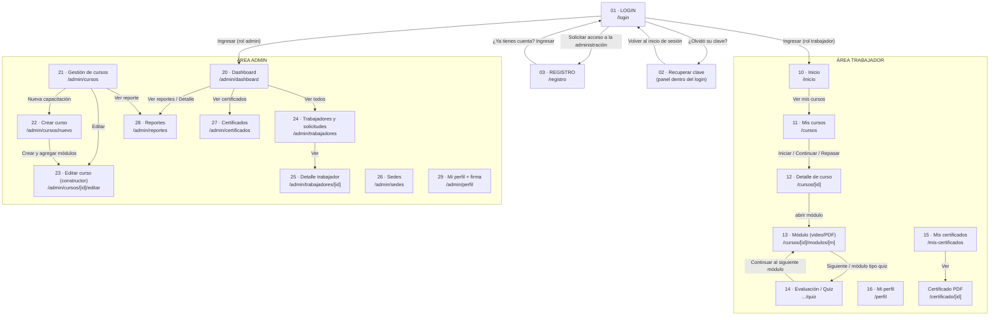

# Flujo completo de la plataforma — KimünKo / ONG Alumco LMS

> Documento de demo: explica **pantalla por pantalla** qué hace cada vista y a dónde
> lleva **cada botón** (las "flechas"). Las capturas viven en [`./capturas/`](./capturas).
>
> - **Producto:** KimünKo (plataforma de capacitación) · **Cliente:** ONG Alumco.
> - **URL demo:** https://alumco-lms.vercel.app
> - **Capturas tomadas:** 2026-06-15 contra el deploy de producción (Vercel).
> - **Stack:** Next.js 16 (App Router) + Supabase (auth + datos).

La plataforma tiene **dos grandes áreas** detrás del login:

| Área | Quién entra | Ruta base | Color de menú |
|------|-------------|-----------|---------------|
| **Trabajador** (colaborador) | rol `trabajador` | `/inicio`, `/cursos`, `/mis-certificados`, `/perfil` | barra lateral azul, ítems: Inicio / Mis Cursos / Certificados / Mi Perfil |
| **Administrador** | rol `admin` / `profesor` | `/admin/...` | barra lateral azul, ítems: Dashboard / Cursos / Trabajadores / Sedes / Reportes / Certificados / Mi perfil |

El **login decide a dónde te manda** según tu rol (ver flecha en `01-login`).

---

## Mapa de flujo (resumen visual)

> Las flechas que NO están en el diagrama son las del **menú lateral**: en cada
> pantalla del área, los ítems del menú llevan directo a su sección. "Cerrar Sesión"
> (rojo, abajo del menú) cierra sesión y vuelve a `/login`.

---

## 0. Acceso (públicas)

### 01 · Login — `/login`

**Qué es:** puerta de entrada. Panel de marca a la izquierda (KimünKo), formulario a la derecha (logo Alumco).

**Botones y flechas:**
| Elemento | A dónde lleva |
|----------|---------------|
| Campo **Correo electrónico** + **Contraseña** | — |
| 👁 (ojo en contraseña) | muestra/oculta la contraseña |
| **¿Olvidó su clave?** | abre el panel de recuperación → ver `02` |
| **Ingresar →** (botón azul) | valida y entra: **trabajador → `/inicio`**, **admin → `/admin/dashboard`** |
| **Solicitar acceso a la administración** | → `/registro` (pantalla `03`) — *este es el botón que marcaste en rojo* |
| Términos / Política / Soporte (pie) | enlaces informativos |

**Qué mostrar:** escribir credenciales y entrar; señalar que el mismo login distingue trabajador vs admin.

---

### 02 · Recuperar contraseña — panel dentro de `/login`

**Qué es:** al pulsar *¿Olvidó su clave?* el formulario se reemplaza por el de recuperación (no cambia la URL).

**Botones y flechas:**
| Elemento | Acción |
|----------|--------|
| Campo **Correo electrónico** | — |
| **Enviar enlace de recuperación** | envía el correo con el enlace de reseteo |
| **← Volver al inicio de sesión** | vuelve al formulario de login |

---

### 03 · Registro / Solicitar acceso — `/registro`

**Qué es:** un colaborador **solicita** una cuenta. No queda activo de inmediato: un admin debe aprobarlo.

**Botones y flechas:**
| Elemento | Acción |
|----------|--------|
| Nombre completo · RUT · Correo · Contraseña (mín. 8) · Confirmar contraseña | datos de la solicitud |
| Aviso ámbar | "Tu solicitud será revisada por un administrador antes de activar tu cuenta. Recibirás un correo cuando sea aprobada." |
| **Enviar solicitud** | crea la solicitud (queda pendiente en `/admin/trabajadores`) |
| **¿Ya tienes cuenta? Ingresar** | → `/login` |

---

## 1. Área Trabajador (login: `Baptiste@gmail.com`)

> Menú lateral común: **Inicio** → `/inicio` · **Mis Cursos** → `/cursos` ·
> **Certificados** → `/mis-certificados` · **Mi Perfil** → `/perfil` ·
> **Cerrar Sesión** (rojo) → logout.

### 10 · Inicio del trabajador — `/inicio`

**Qué es:** panel de bienvenida con su estado de capacitación.

**Botones y flechas:**
| Elemento | A dónde lleva |
|----------|---------------|
| Hero "Tienes N cursos vencidos" + **Ver mis cursos →** | → `/cursos` |
| Tarjetas: Total de cursos / En progreso / Cumplimiento % / Vencidos | indicadores (no navegan) |
| **Ver todos los cursos →** | → `/cursos` |
| **Plazos de cursos** (calendario) | muestra fechas límite; los puntos marcan vencido / por vencer / a tiempo |

---

### 11 · Mis cursos (catálogo) — `/cursos`

**Qué es:** todos los cursos asignados a su **área de trabajo** (aquí, Enfermería).

**Botones y flechas:**
| Elemento | A dónde lleva |
|----------|---------------|
| Pestañas **Todos / En progreso / Completados / Sin iniciar** | filtran la grilla (`?filter=`) |
| Tarjeta de curso — botón **Iniciar / Continuar / Repasar** | → `/cursos/[id]` (detalle, pantalla `12`) |
| Badge de la tarjeta (COMPLETADO / EN PROGRESO / SIN INICIAR) + barra | estado y % de avance |

---

### 12 · Detalle de curso — `/cursos/[id]`

**Qué es:** portada del curso con su ruta de módulos.

**Botones y flechas:**
| Elemento | A dónde lleva |
|----------|---------------|
| Breadcrumb **Mis cursos** | → `/cursos` |
| Barra **Progreso del curso** | % y "N de M módulos completados" |
| Lista **Contenido del curso** — cada módulo (VIDEO / PDF / EVALUACIÓN, OBLIGATORIO) con **Repasar / Continuar / Comenzar** | → `/cursos/[id]/modulos/[moduleId]` (pantalla `13`); un módulo tipo *Evaluación* lleva al quiz (`14`) |

**Nota:** los módulos se desbloquean en orden — hay que completar el anterior para abrir el siguiente.

---

### 13 · Módulo (video / PDF) — `/cursos/[id]/modulos/[moduleId]`

**Qué es:** el contenido en sí. Reproductor de video (YouTube embebido) o visor de PDF. Al terminarlo se marca **Módulo completado**.

**Botones y flechas:**
| Elemento | A dónde lleva |
|----------|---------------|
| Reproductor / visor | reproduce; al completar registra el avance |
| **← Volver al curso** | → `/cursos/[id]` |
| **Anterior: …** | → módulo previo |
| **Siguiente: …** | → módulo siguiente (o **Completar curso** si es el último) |
| Sidebar **Contenido del curso** (índice) | cada módulo es un enlace directo |
| Sidebar **Sobre este curso** | totales (N módulos, N completados) |
| **Contactar administrador** (ámbar) | abre correo (`mailto:`) al admin |

**Caso bloqueado:** si el módulo previo no está completo, muestra "Módulo bloqueado" + **Volver al curso**.

---

### 14 · Evaluación / Quiz — `/cursos/[id]/modulos/[moduleId]/quiz`

**Qué es:** la prueba del módulo. Tiene intentos limitados y puntaje mínimo de aprobación.

**Botones y flechas:**
| Pantalla | Elemento | Acción |
|----------|----------|--------|
| Intro (`14`) | "Intento X de N" · "Puntaje mínimo: 70%" · "N preguntas · ~min" | datos de la evaluación |
| Intro (`14`) | **▷ Comenzar evaluación** | abre las preguntas (`14b`) |
| Preguntas (`14b`) | Opciones A/B/C/D (radio) por pregunta | seleccionar respuesta |
| Preguntas (`14b`) | **Enviar evaluación** (se activa al responder todo) | corrige y muestra resultado |
| Resultado | aprobado → **Continuar al siguiente módulo**; reprobado → reintentar (si quedan intentos) | |
| Ya aprobado | "Ya aprobaste esta evaluación" + historial de intentos + **Continuar al siguiente módulo** | |

**Nota:** si el curso no pertenece a tu área, muestra "Acceso no permitido" + **Volver a mis cursos**.

---

### 15 · Mis certificados — `/mis-certificados`

**Qué es:** historial de cursos aprobados con su certificado.

**Botones y flechas:**
| Elemento | A dónde lleva |
|----------|---------------|
| Badge "N certificados" | total emitidos a tu nombre |
| Tarjeta de certificado — **Ver** (ámbar) | → vista del certificado en PDF (`/certificado/[certificateId]`) |

---

### 16 · Mi perfil (trabajador) — `/perfil`

**Qué es:** datos personales y resumen de avance.

**Botones y flechas:**
| Elemento | Acción |
|----------|--------|
| Datos: correo, RUT, sede, fecha de ingreso, estado (Activo) | solo lectura |
| **Áreas de trabajo asignadas** | las define el admin (no editable aquí) |
| **Información personal editable** → Fecha de nacimiento + **Guardar cambios** | actualiza el dato |
| Tarjetas Completados / En progreso / Sin iniciar / Certificados | indicadores |

---

## 2. Área Administrador (login: `da.ongalumco@gmail.com`)

> Menú lateral común: **Dashboard** → `/admin/dashboard` · **Cursos** → `/admin/cursos` ·
> **Trabajadores** → `/admin/trabajadores` · **Sedes** → `/admin/sedes` ·
> **Reportes** → `/admin/reportes` · **Certificados** → `/admin/certificados` ·
> **Mi perfil** → `/admin/perfil` · **Cerrar Sesión** (rojo) → logout.

### 20 · Dashboard admin — `/admin/dashboard`

**Qué es:** centro de control con métricas y alertas del mes.

**Botones y flechas:**
| Elemento | A dónde lleva |
|----------|---------------|
| Hero (trabajadores / cumplimiento / cursos activos) | indicadores |
| **Requieren seguimiento** (tabla) → **Ver todos** | → `/admin/trabajadores` |
| **Vencimientos próximos** → **Ver reportes** | → `/admin/reportes` |
| **Cumplimiento por sede** → **Detalle** | → `/admin/reportes` |
| **Cursos más completados** | ranking |
| **Certificados este mes** → **Ver certificados** | → `/admin/certificados` |

---

### 21 · Gestión de cursos — `/admin/cursos`

**Qué es:** listado de todas las capacitaciones (publicadas y borradores).

**Botones y flechas:**
| Elemento | A dónde lleva |
|----------|---------------|
| **+ Nueva capacitación** (arriba a la derecha) | → `/admin/cursos/nuevo` (pantalla `22`) |
| Pestañas **Todos / Publicados / Borradores** | filtran la grilla |
| Tarjeta — **Editar** | → `/admin/cursos/[id]/editar` (constructor, pantalla `23`) |
| Tarjeta — **Ver reporte** | → `/admin/reportes?curso=[id]` |

---

### 22 · Crear nuevo curso — `/admin/cursos/nuevo`

**Qué es:** paso 1 de crear una capacitación (datos básicos).

**Botones y flechas:**
| Elemento | Acción |
|----------|--------|
| **Título del curso*** · **Descripción** | datos base |
| **Fecha límite de cumplimiento** · **Descripción del plazo** | plazo de la capacitación |
| **Área objetivo**: **Todas las áreas** / **Seleccionar áreas** | a qué áreas se asigna |
| **Cancelar** | → `/admin/cursos` |
| **Crear y agregar módulos →** | crea el curso y abre el constructor → `/admin/cursos/[id]/editar` (`23`) |

---

### 23 · Editar curso / constructor — `/admin/cursos/[id]/editar`

**Qué es:** paso 2 — armar la ruta de aprendizaje arrastrando bloques.

**Botones y flechas:**
| Elemento | Acción |
|----------|--------|
| **Publicado / Despublicar** | cambia visibilidad para los trabajadores |
| **Eliminar** (rojo) | borra el curso |
| Lista de bloques (Video / PDF / Evaluación) — *arrastrar* | reordena la ruta |
| Iconos ✏️ / 🗑 por bloque | editar / eliminar ese módulo |
| Panel **Agregar bloque**: **Video** (YouTube), **PDF**, **Evaluación** | añade un módulo nuevo |
| **Área objetivo**: Todas / Por área + **Guardar áreas** | reasigna áreas |

---

### 24 · Trabajadores y solicitudes — `/admin/trabajadores`

**Qué es:** padrón de colaboradores + solicitudes de acceso pendientes (las que vienen de `03 · Registro`).

**Botones y flechas:**
| Elemento | A dónde lleva |
|----------|---------------|
| Pestañas (Trabajadores activos / Solicitudes / …) | cambia la vista; en *Solicitudes* se aprueba/rechaza |
| **+ Agregar trabajador** | alta manual de un colaborador |
| Filtros (sede / área / orden) | acotan la tabla |
| Fila — **Ver →** | → `/admin/trabajadores/[id]` (pantalla `25`) |

---

### 25 · Detalle de trabajador — `/admin/trabajadores/[id]`

**Qué es:** ficha individual con su avance por curso.

**Botones y flechas:**
| Elemento | Acción |
|----------|--------|
| **Editar** | modifica datos / áreas del trabajador |
| **Suspender** (rojo) | desactiva la cuenta |
| Tarjetas (Completados / En progreso / Sin iniciar / Certificados) | indicadores |
| **Progreso por curso** (tabla) | estado y fecha de cada curso |

---

### 26 · Sedes — `/admin/sedes`

**Qué es:** las residencias/sedes de la organización (p. ej. Hualpén, Coyhaique).

**Botones y flechas:**
| Elemento | Acción |
|----------|--------|
| **Crear nueva sede**: campo nombre + **+ Crear sede** | agrega una sede |
| Tarjeta sede — **Desactivar sede** (roja, si activa) / **Activar sede** (verde, si inactiva) | cambia el estado |
| Contador "N trabajadores activos" | por sede |

---

### 27 · Certificados (admin) — `/admin/certificados`

**Qué es:** todos los certificados emitidos en la organización.

**Botones y flechas:**
| Elemento | Acción |
|----------|--------|
| Filtros / buscador | acotan la tabla |
| Tabla (trabajador · curso · fecha · estado) | listado completo |
| Acción por fila (ver / descargar) | abre el certificado |

---

### 28 · Reportes — `/admin/reportes`

**Qué es:** reporte de cumplimiento por trabajador (con filtros por sede/curso).

**Botones y flechas:**
| Elemento | Acción |
|----------|--------|
| Tarjetas resumen (total / al día / pendientes / cumplimiento %) | indicadores |
| Filtros (sede, área, curso) | acotan |
| Tabla por trabajador (cumplimiento %) | detalle |

> Se llega aquí desde el Dashboard ("Ver reportes" / "Detalle") y desde cada curso ("Ver reporte", con `?curso=[id]` ya filtrado).

---

### 29 · Mi perfil (admin) + firma digital — `/admin/perfil`

**Qué es:** datos del admin **y la firma digital** que se estampa en los certificados que emite.

**Botones y flechas:**
| Elemento | Acción |
|----------|--------|
| Datos personales + **Guardar cambios** | actualiza info |
| **Firma digital** → **Subir firma digital** (PNG/JPG, fondo transparente, máx 2 MB) | esa firma se incluye automáticamente en los certificados de los cursos que creó |
| Tarjetas (Cursos creados / Trabajadores capacitados / Aprobación % / Certificados emitidos) | indicadores |

---

## 3. Pública adicional (no capturada)

### Certificado verificable — `/certificado/[certificateId]`
Vista pública de un certificado (para verificar su validez). Se abre desde **Ver** en
`15 · Mis certificados`. No se incluyó captura porque requiere el ID de un certificado real;
si lo necesitas, dímelo y lo agrego.

---

## Apéndice — inventario de capturas

| # | Archivo | Pantalla | Ruta |
|---|---------|----------|------|
| 01 | `01-login.png` | Login | `/login` |
| 02 | `02-login-olvido-clave.png` | Recuperar clave | `/login` (panel) |
| 03 | `03-registro.png` | Registro / Solicitar acceso | `/registro` |
| 10 | `10-trab-inicio.png` | Inicio trabajador | `/inicio` |
| 11 | `11-trab-cursos.png` | Mis cursos | `/cursos` |
| 12 | `12-trab-curso-detalle.png` | Detalle de curso | `/cursos/[id]` |
| 13 | `13-trab-modulo.png` | Módulo (video/PDF) | `/cursos/[id]/modulos/[m]` |
| 14 | `14-trab-quiz.png` | Quiz — intro | `.../quiz` |
| 14b | `14b-trab-quiz-pregunta.png` | Quiz — preguntas | `.../quiz` |
| 15 | `15-trab-certificados.png` | Mis certificados | `/mis-certificados` |
| 16 | `16-trab-perfil.png` | Perfil trabajador | `/perfil` |
| 20 | `20-admin-dashboard.png` | Dashboard admin | `/admin/dashboard` |
| 21 | `21-admin-cursos.png` | Gestión de cursos | `/admin/cursos` |
| 22 | `22-admin-curso-nuevo.png` | Crear curso | `/admin/cursos/nuevo` |
| 23 | `23-admin-curso-editar.png` | Editar curso (constructor) | `/admin/cursos/[id]/editar` |
| 24 | `24-admin-trabajadores.png` | Trabajadores y solicitudes | `/admin/trabajadores` |
| 25 | `25-admin-trabajador-detalle.png` | Detalle trabajador | `/admin/trabajadores/[id]` |
| 26 | `26-admin-sedes.png` | Sedes | `/admin/sedes` |
| 27 | `27-admin-certificados.png` | Certificados (admin) | `/admin/certificados` |
| 28 | `28-admin-reportes.png` | Reportes | `/admin/reportes` |
| 29 | `29-admin-perfil.png` | Perfil admin + firma | `/admin/perfil` |
